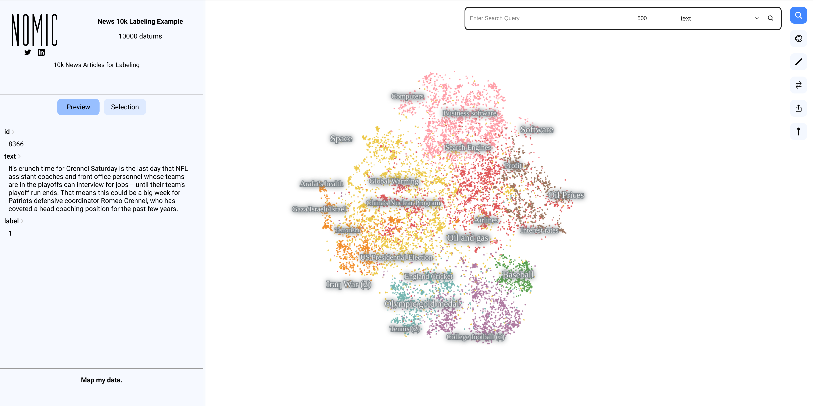
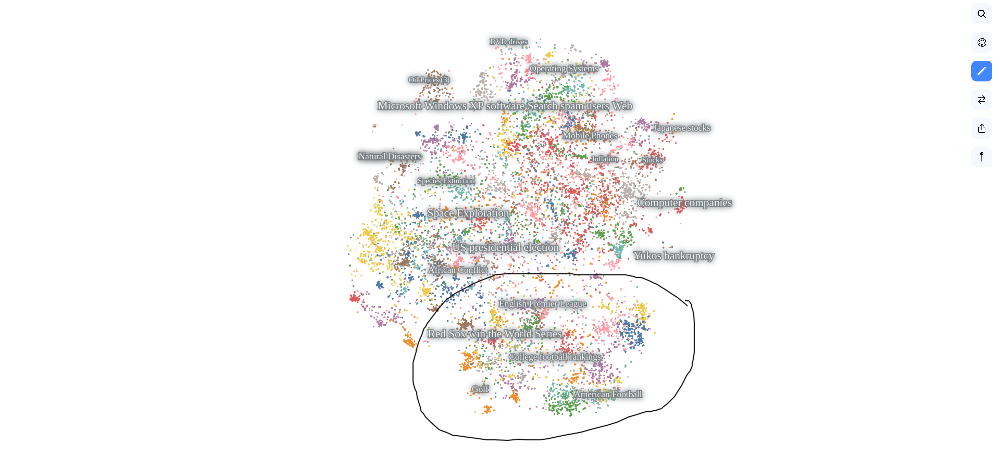
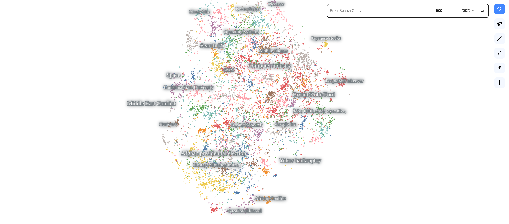

# Labeling Text in Atlas
This tutorial describes how to use Atlas to quickly label or tag a large corpus of text in Atlas.

Atlas provides insights into a text corpus by organizing its documents onto a map.
Documents of text that are semantically similar cluster together on a map allowing for the following 
data labeling workflow:

1. Make a map of your data.
2. Use the lasso tool in Atlas to tag regions based on your domain expertise.
3. Access your annotated tags with an [AtlasProject](atlas_api.md)'s `get_tags` method.

Tags can then be funneled into a downstream machine learning model, used to clean your dataset by deleting points from your project and
leveraged to build new maps on subsets of your data.

## Example: Labeling a News dataset.
In this example, we will map and label a news dataset from the Huggingface hub.
To start, load the dataset [ag_news](https://huggingface.co/datasets/ag_news), randomly sample 10,000 points and map it.

The dataset is composed of news articles scraped by an [academic news scraping engine](http://groups.di.unipi.it/~gulli/AG_corpus_of_news_articles.html) after 2004.

=== "Data Labeling Example"

    ``` py
    from nomic import atlas
    import numpy as np
    from datasets import load_dataset
    
    np.random.seed(0)  # so your map has the same points sampled.
    
    dataset = load_dataset('ag_news')['train']
    
    max_documents = 10000
    subset_idxs = np.random.randint(len(dataset), size=max_documents).tolist()
    documents = [dataset[i] for i in subset_idxs]
    for i in range(len(documents)):
        documents[i]['id'] = i
    
    project = atlas.map_text(data=documents,
                             id_field='id',
                             indexed_field='text',
                             map_name='News 10k Labeling Example',
                             map_description='10k News Articles for Labeling'
                             )
    print(project.maps)
    ```

Produces a map that should roughly resemble this:



Next, use the lasso tool to tag regions of interest. In this example, we're going to remove
all the sports related news articles from the dataset.

Notice, that all the sports articles are pre-organized into one region of the map. This is because the neural
networks that power Atlas produce vectors for sports articles that are all similar to each other.



After tagging this lassoed region as 'sports', we can access all the tagged points programmatically.
To do this, load the AtlasProject and access the annotated tags with the `get_tags` method. 

=== "Retrieving Tags"

    ``` py
    from nomic import AtlasProject
    project = AtlasProject(name='News 10k Labeling Example')

    tags = project.get_tags()
    for tag, datum_ids in tags.items():
        print(tag, "Count:", len(datum_ids), datum_ids[:10])
    
    print(project.get_data(ids=tags['sports'][:2]))
    ```

=== "Output"
    ```
    sports Count: 2532 ['1003', '1005', '1006', '1010', '1015', '1016', '102', '103', '1031', '1033']
    [
    {'id': 1003, 'text': 'Boxing: Ronald Wright retains titles Ronald Wright used an effective right jab to retain his World Boxing Association and World Boxing Council junior middleweight titles when posting a majority decision over former champion Shane Mosley in Las Vegas yesterday.', 'label': 1},
    {'id': 1005, 'text': 'U.S. Furious at Proposal That Hamm Return His Gold  ATHENS (Reuters) - U.S. Olympic chiefs reacted furiously  Friday to a suggestion all-round champion Paul Hamm should give  his gold medal to a South Korean rival under a plan floated by  the governing body of world gymnastics.', 'label': 1}
    ]
    ```

Viewing the output you can see that we tagged 2532 text documents with 'sports' label. Pretty fast huh?

### Cleaning away the sports.

Now delete all the datums we tagged as sports from the project. Following from the previous code block:

=== "Delete all news about sports"

    ``` py
    project.delete_data(ids=tags['sports'])
    project.rebuild_maps()
    ```

Which removes the points tagged as sports from the project and resultantly the map:

